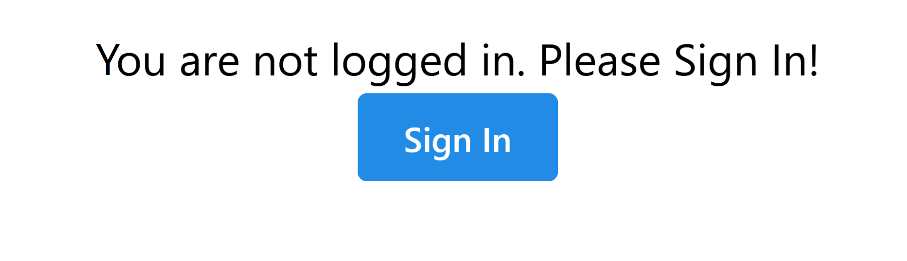

# note-sender-app
A Note Sending App Created with PocketBase &amp; NextJS

## Authentication

### Setting Up Credentials
1) Go to [Google API Authentication Dashboard](https://console.developers.google.com/apis/credentials).
2) Click `Create Credentials`.
3) Choose `Oauth Client ID` from the Dropdown.
4) Set the Application Type to  `Web application`.
5) In the Authorized JavaScript Origins, add `http://localhost:3000`. 
6) In the Authorized Redirect URLs section, it must be one of these fields [outlined here](https://next-auth.js.org/providers/google):

  `For production: https://{YOUR_DOMAIN}/api/auth/callback/google`
  
  `For development: http://localhost:3000/api/auth/callback/google`

7) Click Create
8) Copy the `Client ID` & `Client Secret` and put it in your `.env` file

`GOOGLE_AUTH_CLIENT_ID=YOUR_CLIENT_ID`

`GOOGLE_AUTH_CLIENT_SECRET=YOUR_CLIENT_SECRET`

# Showcase
## Main Page After Logging In
> 
## Create Note Modal Window
> 

##  Note Create Notification | [@mantine/notifications](https://mantine.dev/core/notification/)  
> 

## List of Notes
> 

## Dynamic IDs for Notes
> 

# User Interface
I have used [MantineUI](https://mantine.dev), a component library to style the UI in the application. I am enjoying using it due to it's simplicity and ease of use.
# Database
To setup the database, follow these instructions.

1) Download [Pocketbase](https://pocketbase.io/docs) for your operating system.
2) Drag and drop it into the project directory
3) Run `$ pocketbase serve` to start the database, the default port is `:8090`

# Why?
I wanted to create a small project with [Pocketbase](https://pocketbase.io/) and [Mantine UI](https://mantine.dev)